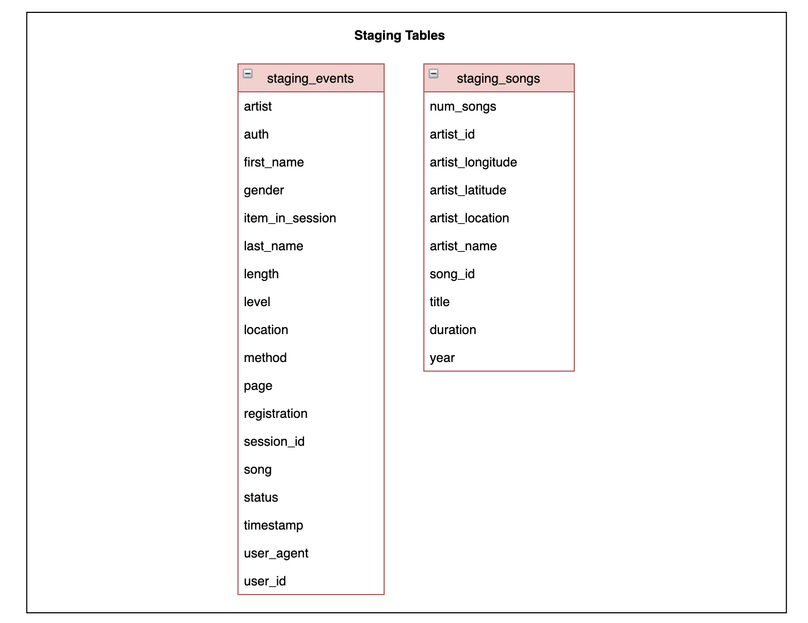
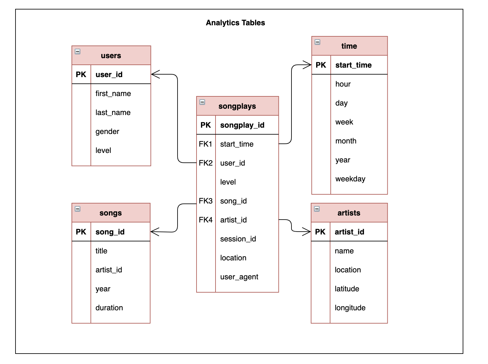

# Data Modelling with Redshift

## 1. Summary

The purpose of this repo is to create a Redshift database with tables designed to optimize queries on song play analysis. 

The data resides in S3, in a directory of JSON logs on user activity on the app, and a directory with JSON metadata on the songs. 

The ETL pipeline extracts the data from S3, stages the data in Redshift, and finally transforms it into a set of fact and dimension tables that can be analyzed. 

## 2. Installation & Steps 

1. Launch a redshift cluster in the AWS console and create an IAM role that has read access to S3.
2. Add redshift database and IAM role info to `dwh.cfg`. 
3. On your terminal, run `create_tables.py` to create the tables in AWS Redshift. This module connects to the Redshift cluster, drops any existing tables, and creates all tables.
4. On your terminal, run `etl.py`. This module connects to the Redshift cluster database, copies log_data and song_data from S3 into staging tables, and finally transforms/loads that data into the five fact and dimension tables.
4. Delete your redshift cluster when finished. 

## 4. Datasets

### 4.1. Song Dataset

The first dataset is a subset of real data from the [Million Song Dataset](https://labrosa.ee.columbia.edu/millionsong/). Each file is in JSON format and contains metadata about a song and the artist of that song. The files are partitioned by the first three letters of each song's track ID. 

For example, here is the filepath to a file in this dataset: `song_data/A/A/B/TRAABJL12903CDCF1A.json`

And below is an example of what a single song file, `TRAABJL12903CDCF1A.json`, looks like.

```{"num_songs": 1, "artist_id": "ARJIE2Y1187B994AB7", "artist_latitude": null, "artist_longitude": null, "artist_location": "", "artist_name": "Line Renaud", "song_id": "SOUPIRU12A6D4FA1E1", "title": "Der Kleine Dompfaff", "duration": 152.92036, "year": 0}```

### 4.2. Log Dataset 

The second dataset consists of log files in JSON format generated by this [event simulator](https://github.com/Interana/eventsim) based on the songs in the dataset above. These simulate activity logs from a music streaming app based on specified configurations.

The log files in the dataset you'll be working with are partitioned by year and month. For example, here is the filepath to a file in this dataset:
`log_data/2018/11/2018-11-12-events.json`

## 5. Files     

- `create_table.py` creates the fact and dimension tables for the star schema in Redshift.
- `etl.py` loads data from S3 into staging tables on Redshift and then processes that data into the analytics tables on Redshift.
- `sql_queries.py` defines the SQL statements, which will be imported into the two files above.

## 6. Database Schema 

Two staging tables (staging_events, staging_songs) capture all of the data from S3. It is then transformed and loaded into a fact table (songplays) and four dimension tables (users, songs, artists, time). `create_tables.py` connects to the Redshift cluster, drops any existing tables, and creates the seven tables, and SQL queries are defined in `sql_queries.py`. 


